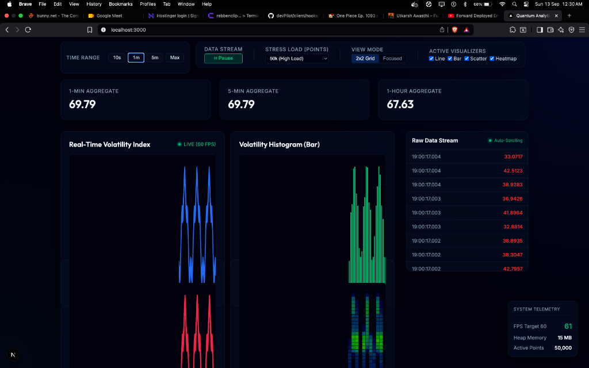

# Quantum Analytics Dashboard

A high-performance, real-time data visualization dashboard engineered to render **10,000 to 100,000 active data points at a sustained 60 FPS**.

By leveraging a **hybrid HTML5 Canvas + SVG rendering engine**, background **Web Workers**, and strict **zero-allocation typed array memory management**, this dashboard pushes the boundaries of browser-based data streaming without relying on third-party charting libraries.

---

## 📸 Feature Overview with Screenshots



### Core Dashboard Capabilities

1. **Synchronized 2x2 Multi-Chart Grid & Focused Tab View**:
   - **Real-Time Volatility Index (Line Chart)**: High-speed path rendering with dynamic auto-scaling Y-axis.
   - **Volatility Histogram (Bar Chart)**: Visual pixel-binning and aggregation across dynamic time buckets.
   - **Signal Distribution (Scatter Plot)**: High-density scatter plots with value-based velocity color maps.
   - **Matrix Density (Heatmap)**: 2D temporal-value density grid with dynamic opacity scaling.
   - Switch seamlessly between a **2x2 Grid** view and a **Focused** single-chart tabbed view without frame drops.

2. **Hybrid Canvas + SVG Interactive Architecture**:
   - High-density data points are painted natively to an **HTML5 2D Canvas** with zero DOM overhead.
   - A synchronized, transparent **SVG Overlay** tracks mouse movement, projecting vertical/horizontal crosshairs, value tooltips, and snap points across all active visualizers simultaneously.

3. **Virtualized Real-Time Data Stream Table**:
   - Handles tens of thousands of streaming records with $O(1)$ constant DOM node count.
   - Features **Smart Auto-Scroll & Freeze**: Scrolling up instantly pauses the table view snapshot for forensic inspection, and the **Jump to Latest** button re-engages live tracking.

4. **Multi-Window Sliding Aggregates**:
   - Displays real-time **1-Minute**, **5-Minute**, and **1-Hour** rolling averages calculated concurrently inside the Web Worker.

5. **Live System Telemetry HUD**:
   - Persistent overlay monitoring real-time **FPS** (target: 60 FPS), **JS Heap Memory** usage (via Chromium performance memory API), and total **Active Data Points**.

---

## 🚀 Setup Instructions

Ensure you have **Node.js 18+** installed on your system.

### 1. Install Dependencies
```bash
npm install
```

### 2. Run the Development Server
```bash
npm run dev
```
Open [http://localhost:3000](http://localhost:3000) in your browser to view the live dashboard.

### 3. Build for Production
To test production optimizations and bundle minification:
```bash
npm run build
npm run start
```

---

## 🧪 Performance Testing Instructions

The top Control Ribbon provides interactive controls to stress-test rendering throughput and stream mechanics:

1. **Stress Test Load Selector**:
   - **Standard (10,000 points)**: Baseline high-throughput streaming.
   - **High Load (50,000 points)**: Simulates intense market or telemetry volatility.
   - **Extreme Stress Test (100,000 points)**: Renders 100k active coordinates concurrently across the charts at 60 FPS.
   - *Observation*: Watch the **System Telemetry HUD** in the bottom-right corner — FPS remains pinned at ~60 FPS while JS Heap memory stays compact (~15MB–25MB).

2. **Time Range Selector (Synchronized Zooming)**:
   - Toggle between **10s (Live)**, **1m**, **5m**, and **Max Buffer**.
   - All Canvas viewports recalculate their temporal scale and re-project timestamps instantaneously without stutter.

3. **Stream Controls (Pause / Resume)**:
   - Click **Pause** to halt data generation from the Web Worker.
   - Inspect static historical spikes using the crosshair and scroll through the Virtualized Data Table.
   - Click **Resume** to continue streaming smoothly.

4. **Active Visualizer Filters**:
   - Toggle individual visualizers (`Line`, `Bar`, `Scatter`, `Heatmap`) to inspect canvas unmounting and remounting efficiency.

---

## 🌐 Browser Compatibility Notes

This application relies on modern web standards and hardware-accelerated graphics:

| API / Feature | Purpose in Dashboard | Minimum Browser Support |
| :--- | :--- | :--- |
| **Web Workers API** | Off-main-thread data generation & rolling window aggregates | Chrome 4+, Firefox 3.5+, Safari 4+, Edge 12+ |
| **HTML5 Canvas 2D API** | Hardware-accelerated batch primitive rendering | Chrome 1+, Firefox 1.5+, Safari 2+, Edge 12+ |
| **ES6 Typed Arrays (`Float64Array`)** | Zero-allocation contiguous circular memory buffer | Chrome 7+, Firefox 4+, Safari 5.1+, Edge 12+ |
| **CSS Backdrop Filter** | Dark-mode glassmorphic telemetry panels | Chrome 76+, Safari 9+, Firefox 103+, Edge 79+ |
| **Performance Memory API** | In-browser telemetry heap memory profiling | Chromium-based browsers (Chrome 20+, Edge 79+) |

*Recommended: Modern Evergreen browsers (Chrome 90+, Edge 90+, Firefox 88+, Safari 15+).*

---

## ⚡ Next.js Specific Optimizations Used

Built with **Next.js 14 (App Router)** utilizing modern React architecture:

1. **Server vs. Client Component Boundaries**:
   - The root document layout (`app/layout.tsx`) and initial page wrapper (`app/page.tsx`) are Server Components.
   - Client interactivity (`"use client"`) is strictly encapsulated in provider wrappers (`DataProvider`, `ControlProvider`) and leaf components, keeping initial server-rendered HTML lightweight and avoiding hydration mismatches.

2. **Zero-CLS Font Optimization (`next/font/google`)**:
   - Utilizes `Geist` and `Geist_Mono` via `next/font`. Next.js automatically downloads and self-hosts the font files at build time, eliminating external Google CDN network hops and completely preventing Cumulative Layout Shift (CLS).

3. **Segmented App Router Layouts**:
   - Leverages Next.js layout trees so that static chrome and container boundaries remain intact without DOM re-creation during data stream updates.

4. **Production Asset Bundling & Minification**:
   - Native Webpack 5 / SWC minification compiles the Web Worker modular script (`new Worker(new URL(...), import.meta.url)`) into optimized chunk assets with tree shaking.
